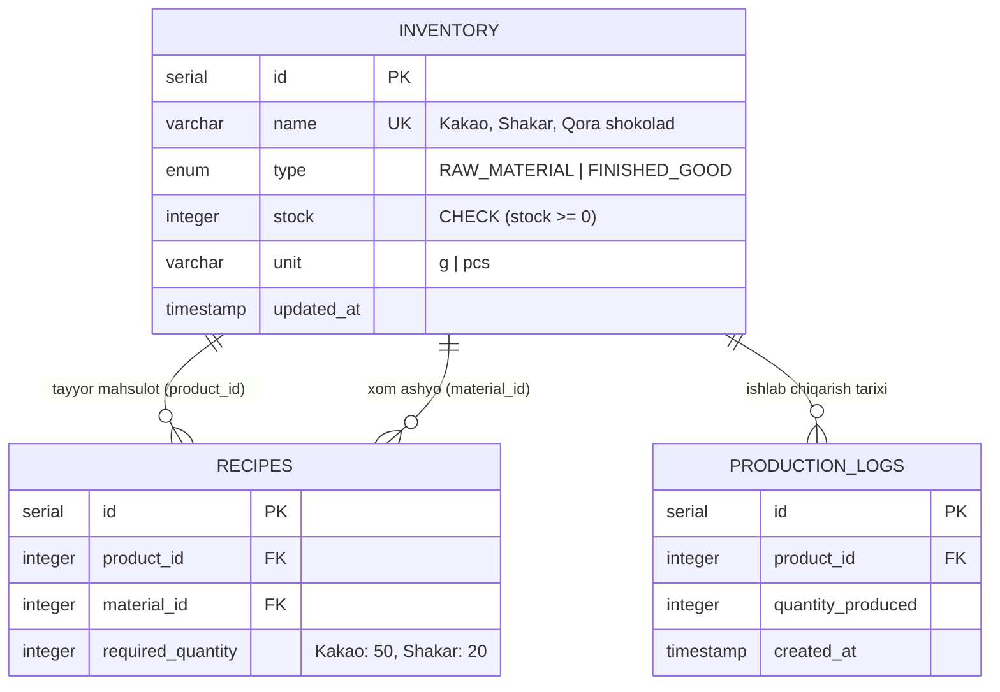
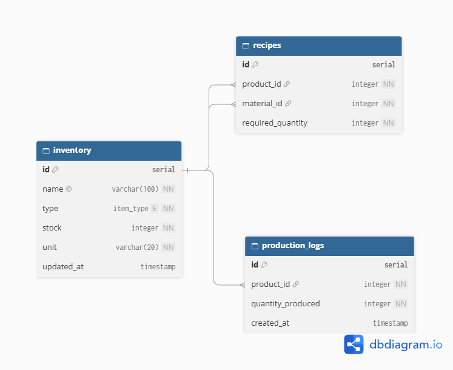

# Chocolate Factory

## Database

```mermaid
erDiagram
    INVENTORY ||--o{ RECIPES : "tayyor mahsulot (product_id)"
    INVENTORY ||--o{ RECIPES : "xom ashyo (material_id)"
    INVENTORY ||--o{ PRODUCTION_LOGS : "ishlab chiqarish tarixi"

    INVENTORY {
        serial id PK
        varchar name UK "Kakao, Shakar, Qora shokolad"
        enum type "RAW_MATERIAL | FINISHED_GOOD"
        integer stock "CHECK (stock >= 0)"
        varchar unit "g | pcs"
        timestamp updated_at
    }

    RECIPES {
        serial id PK
        integer product_id FK
        integer material_id FK
        integer required_quantity "Kakao: 50, Shakar: 20"
    }

    PRODUCTION_LOGS {
        serial id PK
        integer product_id FK
        integer quantity_produced
        timestamp created_at
    }
```

## db.diagram

[Visit db.diagram schema](https://dbdiagram.io/d/chocolate_factory-6aec0f8ff1d298b57370686d)

## DB Picture

